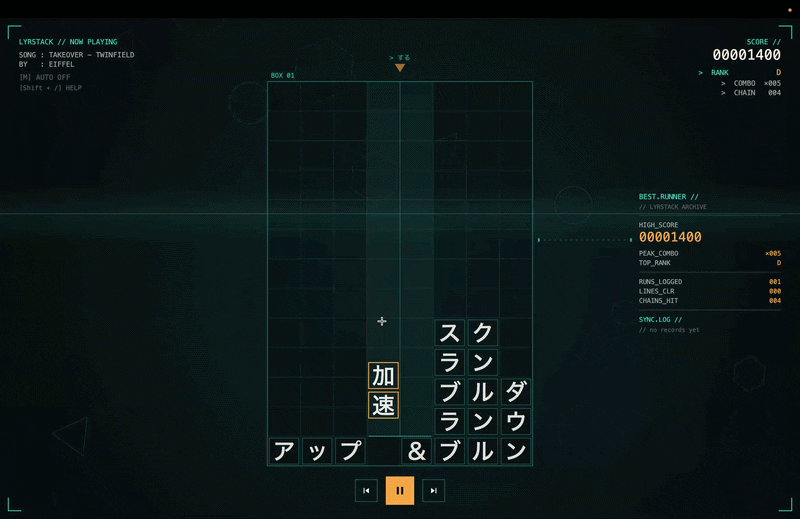

# LyrStack

> Stack the lyrics. Don't overflow the box.



A tetris-style lyric app for **Hatsune Miku「Magical Mirai 2026」Programming Contest**.
Designated song: **TAKEOVER** by Twinfield.

Built with [TextAlive App API](https://developer.textalive.jp/) + Canvas 2D, no backend.

---

## The idea

Each word the song sings drops into the playfield as a block. You move the
cursor to where you want it to land (mouse or keyboard), fill rows to clear
them, and try not to overflow the box. Overflow = penalty + archive to the
left as `BOX 01`, `BOX 02`, ... fresh box starts.

Auto mode does it for you with a solver that chases line clears.

That's it. Lyrics are the gameplay, not decoration.

---

## Features

- 8-column playfield, pieces fall in sync with the song
- Word-shape: short words = one row, longer = 2-col wrap, vertical for some kana
- Partial line-clear (vertical piece passing through a cleared row only loses
  the cell that was on the row, not the whole piece)
- Combo-only-resets-on-overflow scoring
- Rank D → SSS based on current combo
- Auto mode (M key) — solver does placement
- Keyboard column jumps: `A S D F J K L ;` for cols 1–8
- `BEST.RUNNER` side panel with personal best stats (localStorage)
- SYNC.LOG of last 3 completed plays
- Help overlay: `Shift + /`

---

## Controls

| Key                | Action                     |
| ------------------ | -------------------------- |
| `Space`            | Play / Pause               |
| `M`                | Toggle AUTO                |
| `A S D F`          | Cursor → cols 1–4          |
| `J K L ;`          | Cursor → cols 5–8          |
| Mouse              | Hover to aim cursor        |
| `Shift + /`        | Help overlay               |
| ⏮ / ⏭ button       | Restart from BOX 01        |

---

## Quick start

Prerequisites: [Node.js](https://nodejs.org/) 18 or newer.

```bash
# 1. Install dependencies
npm install

# 2. Start the dev server (opens http://localhost:5173)
npm run dev

# 3. Build a production bundle into ./docs (for GitHub Pages or any HTTP server)
npm run build

# 4. Preview the built bundle
npm run preview
```

---

## Project layout

```
magical-mirai-2026/
├── index.html          # Page shell (canvas + overlay UI)
├── package.json
├── vite.config.js      # Outputs to ./docs to match the official sample layout
└── src/
    ├── main.js         # TextAlive Player + UI wiring
    ├── visualizer.js   # Canvas 2D renderer (playfield, scoring, HUD)
    ├── songs.js        # Active song + catalog of all 6 (active = TAKEOVER)
    ├── emotes.js       # Keyword → tactical icon mapping
    └── style.css       # Page chrome + responsive layout
```

---

## Customising the song

`src/songs.js` exports `SONG` — currently TAKEOVER. All 6 contest songs
sit in `ALL_SONGS`; swap `SONG` to switch.

```js
import { SONG } from "./songs.js";
// SONG.id, SONG.title, SONG.songUrl, SONG.video.{beatId, chordId, ...}
```

`video.*Id` values pin the music-map version (numbers from the
[TextAlive support page](https://developer.textalive.jp/events/magicalmirai2026/)).
This keeps timing stable if TextAlive re-analyses the song later.

**Only TAKEOVER is fully tested.** The others load but edge cases aren't verified.

---

## Tech

-  **Vanilla JavaScript** — ES modules, no framework
-  **HTML5 Canvas 2D** — all rendering, no WebGL / Three.js / Pixi
-  **Vite 5** — dev server + production bundle to `./docs`
- 🎵 **textalive-app-api** — music, lyric, beat, chord sync

---

## Credits

- [Magical Mirai 2026 Programming Contest](https://magicalmirai.com/2026/procon/index_en.html)
- [TextAlive App API](https://developer.textalive.jp/) by AIST
- TAKEOVER by Twinfield, from [Magical Mirai 2026 Song Contest](https://piapro.jp/pages/official_collabo/magical2026_musiccontest/result)
- Scaffold inspired by [textalive-app-basic](https://github.com/TextAliveJp/textalive-app-basic)

Built by **Eiffel**.
